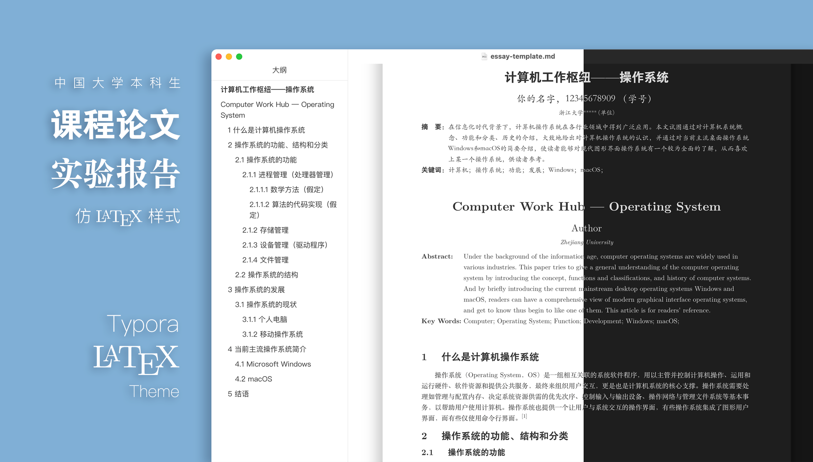

# Awesome Typora

收集 Typora 相关的插件、主题、模板、辅助工具和教程。

## 插件

- [Typora plugin](https://github.com/obgnail/typora_plugin) - Typora 插件，功能增强工具。
- [VLOOK](https://github.com/MadMaxChow/VLOOK) - 优雅好用的 Typora/Markdown 主题包×增强插件。让你的 Markdown 有了新看(wán)法。
- [Typora Community Plugin](https://github.com/typora-community-plugin/typora-community-plugin) - 增强 Typora 编辑体验的社区插件系统。
- [Typora Copilot](https://github.com/Snowflyt/typora-copilot) - [Typora](https://typora.io/) 的 [GitHub Copilot](https://github.com/features/copilot) & [Copilot Chat](https://docs.github.com/copilot/using-github-copilot/copilot-chat) 插件，支持 Windows、macOS 和 Linux。
- [typora-plugin-bilibili](https://github.com/xlzy520/typora-plugin-bilibili) - 支持哔哩哔哩图片上传的 Typora 插件，实现图片粘贴即可上传到哔哩哔哩，并替换链接。
- [Collapsible Section](https://github.com/typora-community-plugin/typora-plugin-collapsible-section) -  折叠/展开 Markdown 章节。

## 主题

|                             名称                             | 说明                                                         |                             效果                             |
| :----------------------------------------------------------: | :----------------------------------------------------------- | :----------------------------------------------------------: |
|   [LaTeX](https://github.com/Keldos-Li/typora-latex-theme)   | 将 Typora 伪装成 LaTeX 的中文样式主题，本科生轻量级课程论文撰写的好帮手。 |        |
| [DrakeTyporaTheme](https://github.com/liangjingkanji/DrakeTyporaTheme) | 十二种主题风格 - Material Google JetBrains Vue Juejin Purple Ayu Dark |  |
|           [Mdmdt](https://github.com/cayxc/Mdmdt)            | 一款极简文档主题，包含亮色和暗色两种主题，是深度定制的个性化 Typora 主题。 |  |
| [Notion for Typora](https://github.com/adrian-fuertes/typora-notion-theme) | 一款漂亮的由 Notion 启发的主题。                             |  |
| [typora-theme-orange-heart](https://github.com/evgo2017/typora-theme-orange-heart) | 一款基于 `markdown-nice` 橙心主题修改的主题。                |  |
| [Blackout](https://github.com/obscurefreeman/typora_theme_blackout) | 一款清晰，高效，精美的**Typora主题。**                       |  |
|   [Spring](https://github.com/SprInec/typora-spring-theme)   | 一款令人如沐春风的 Typora 灵动主题。                         |  |
|     [Lapis](https://github.com/YiNNx/typora-theme-lapis)     | 一款以蓝色为主色调的 Typora 主题。                           |  |
| [Ladder](https://github.com/guangzhengli/typora-ladder-theme) | 一款基于 LXGW 字体和 typora-tailwind-theme 外观的主题。      |  |
| [Tailwind](https://github.com/andredelft/typora-tailwind-theme) | 一款漂亮的基于 [Tailwind Typography](https://tailwindcss.com/docs/typography-plugin) 布局的主题。 |  |

## 模板

- [typora-markdown-resume](https://github.com/CodingDocs/typora-markdown-resume) - 简洁大方的程序员简历模板。
- [LapisCV](https://github.com/BingyanStudio/LapisCV/blob/main/README-CN.md) - 通过 Markdown 轻松打造简历。支持 **VSCode** / **Typora** / **Obsidian** 多平台。风格简洁正式，适用于大部分场景。

## 工具

- [Upgit](https://github.com/pluveto/upgit) - 可以快捷地将文件上传到 Github 仓库并得到其直链。简洁跨平台，不常驻内存。可作为 Typora 的自定义上传器使用。

## 教程
